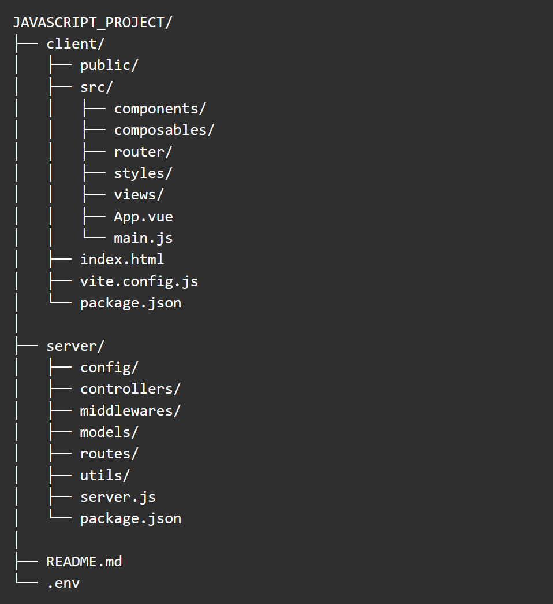

# Kieszonkowe potwory/ポケットモンスター

Projekt full‑stack aplikacji webowej inspirowanej światem Pokémonów. Aplikacja umożliwia
użytkownikom zakładanie kont, przeglądanie Pokédexu, zarządzanie ulubionymi Pokémonami,
interakcje społeczne oraz eksplorację świata w przyjaznym, pixel‑artowym interfejsie.

*Funkcjonalności*

-Rejestracja i logowanie użytkowników (JWT + refresh token)  
-Profil użytkownika  
-Pokédex (dane z zewnętrznego API Pokémon)  
-System ulubionych Pokémonów  
-Lista znajomych i interakcje  
-Widok mapy / eksploracji  
-Onboarding (kilka ekranów startowych)  
-Widok sklepu  
-Responsywny interfejs (mobile‑first)  

*Wykorzystne technologie*

Frontend (client)
-Vue 3 (Composition API)
-Vite
-Vue Router
-HTML5 / CSS3 (custom UI, pixel‑art style)

Backend (server)
-Node.js
-Express.js
-MongoDB (Mongoose)
-JWT (access + refresh tokens)

Zewnętrzne API
-Pokémon API – https://pokeapi.co/docs/v2#moves-section

*Projekt bazy danych:* https://dbdiagram.io/d/68f627632e68d21b415176ce?fbclid=IwY2xjawNjBuVleHRuA2FlbQIxMQABHrAut_gU6xpqYggILeNRRFaoqbePra3KrnKC2bdvHwGrAL3ITYS-mJMWz2l0_aem_MICC1eths_5zeJvUlps6VQ

*Struktura projektu*

Przykładowa konfiguracja plików .env:

client:

VITE_API_URL="http://localhost:(port_server)"
VITE_PORT=(port_client)

server:

PORT = (port_server)
NODE_ENV = "development"

CLIENT_URL = "http://localhost:(port_client)"
MONGODB_CONNECTION_STRING = "mongodb://localhost:27017/NazwaBazyDanych"

BCRYPT_SALT_ROUNDS = 12

JWT_SECRET = "TOP-SECRET"
JWT_EXPIRES = "30m"
JWT_EXPIRES_REMEMBER = "30m"

JWT_REFRESH_SECRET = "TOP-SECRET_TOP-SECRET"
REFRESH_EXPIRES = "12h"
REFRESH_EXPIRES_REMEMBER = "14d"

